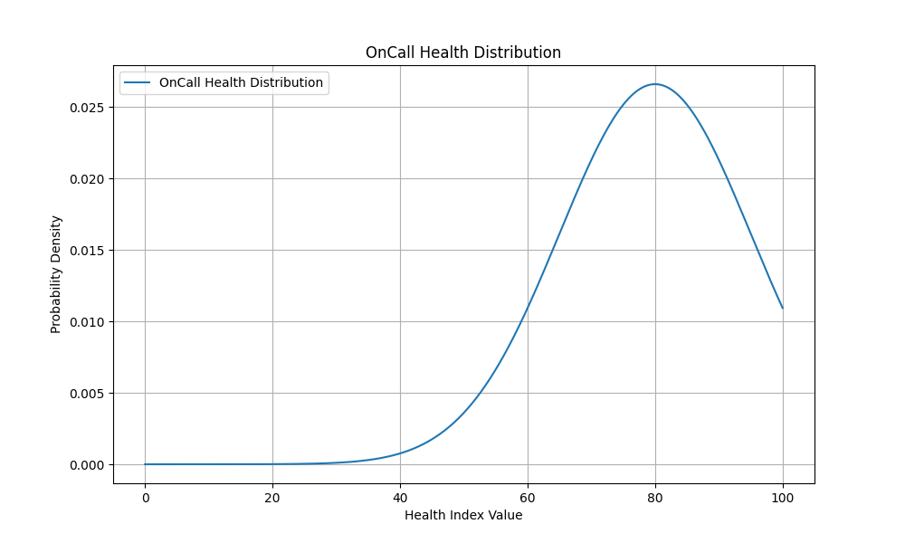

# Oncall Health Index 

## Status: Draft

- OnCall Health index is number 0 to 100 that covers how team doing on-call. Number should help leadership to prevent burnout in teams.
	- We can calculate using this metrics:
		- Total Number Notifications classified by Rank (can be Severity, spread factor or anything else)
  		- How many metrics per week have in range (0, 10k)?
  		- Severity 1-5 (I don't like use Sev0 as someone using but we can map to 1-5)
		- Incident Severity can be Rank depends on company impact (if you wake up people depends on severity or not)
		- Total Hours spent on StandBy in Working Hours, Outside Working Hours, Nights and Weekends
  		- Range is easy week have 168 hours, 40 working hours (country specific?)
  		- Business hours 9-17 (country specific?)
  		- Non-business hours 6-9 and 17-22 (country specific?)
  		- Night work 22-6 (country specific?)
		- Total Hours spent on solving incidents, involving in bridges, working as Incident commander there etc. and again split working hours, outside working hours, nights and weekends
		- Schedule depends we need calibrate how many hours are you in shifts vs outside of shifts. That is quite impact to personal life.
		- How many layers and escalation you have to make safety net for your escalation if something going wrong.
	- How we calibrate it?
		- I think we want get normal distribution in larger sample with peak at 80 to eliminate 0-20 if possible.
			- 
		- We need discuss how assume what is 0 number and what is 100 number.
		- We can make some arbitrary equation and in the end just invert value to get percents but I want see something in my model behind that number.
		- What is 100?
		- What is 50?
		- What is 0?
	- Let's open discussion about it, I want hear your opinions. Please create [github issue](https://github.com/abtris/oncall-heath/issues) or [write me email](mailto:ladislav@prskavec.net?subject=oncall-health).		
